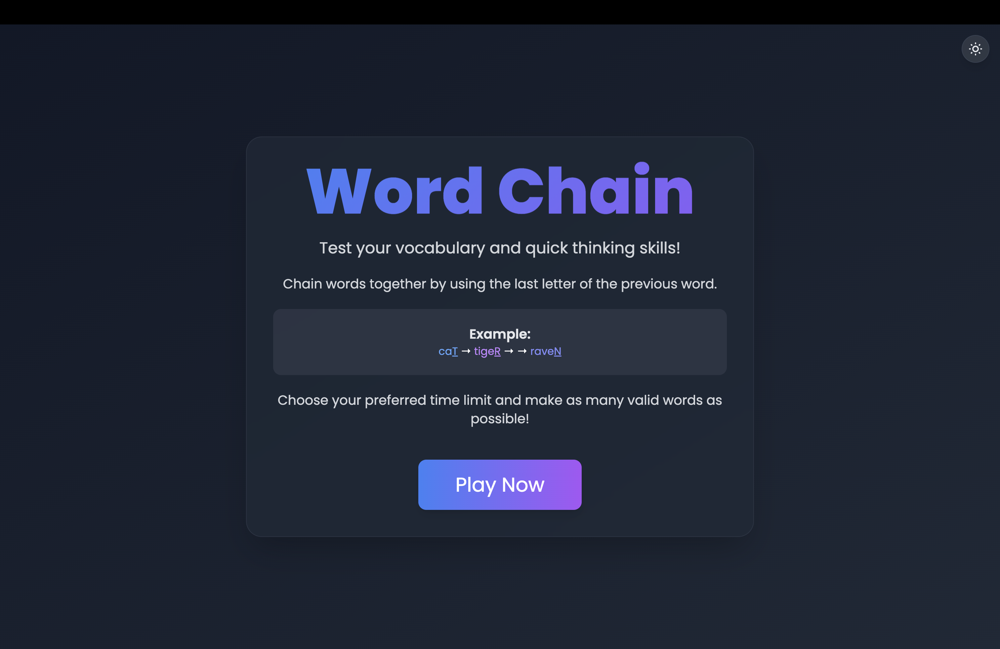
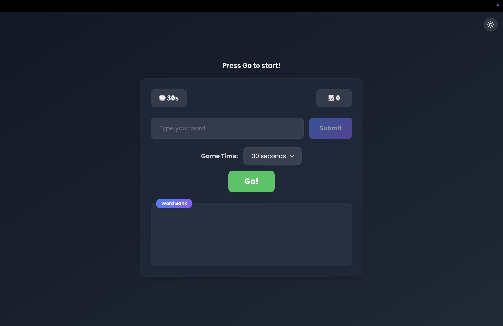
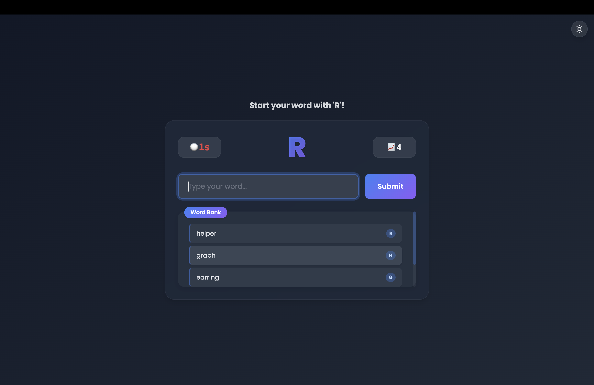
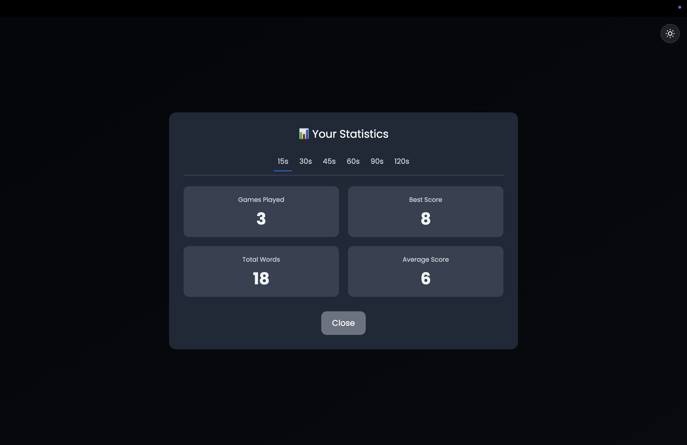

# 🔗 [WordChain](https://wrdchain.netlify.app/)

_A fast-paced word game that challenges your vocabulary and reflexes! Chain words by their last letter and race against the clock._

---

## 🎮 How to Play

1. Start with the word **"cat"**
2. Type a new word that starts with the **last letter** of the current word
3. Example: `"cat"` → `"tiger"` → `"raven"`
4. You have **30 seconds** per round
5. Chain as many valid words as possible before time runs out!

---

## 📜 Rules

- Words must be **at least 2 letters long**
- Each word can only be used **once per round**
- The new word must begin with the **last letter** of the previous word
- The game is **case-insensitive**

---

## ✨ Features

- 🕒 30-second timer
- 📈 Real-time score tracking
- 📊 Game statistics stored in **Local Storage**
- ✅ Visual feedback for valid/invalid entries
- 🧾 Word history display
- 🔁 Play again functionality
- 📊 Stats view for reviewing past performance

---

## 🛠 Technologies Used

- **HTML5**
- **CSS3**
- **JavaScript (ES6+)**
- **Local Storage API**

---

## 📸 Screenshots

| Home Screen             | Game Start                |
| ----------------------- | ------------------------- |
|  |  |

| Mid-Game                  | Game Over                 |
| ------------------------- | ------------------------- |
|  |  |

---

## 🚀 Play Now

👉 [**Launch WordChain on Netlify**](https://wrdchain.netlify.app/)

---
